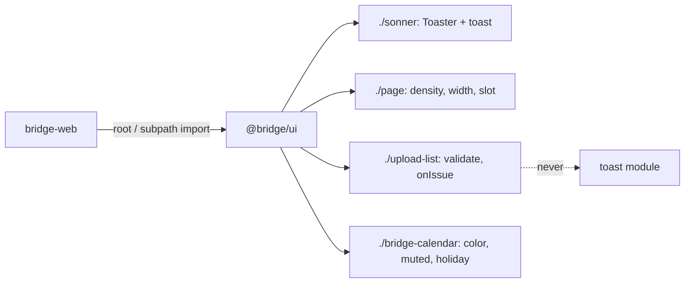

# Design: Consumer Gap Close

## Overview

Add missing capability to owned StyleX components under `app/component/brand/stylex/`, without breaking any shipped API. Every enum-like prop uses `const X = {...} as const` + `type X = ValueOf<typeof X>`. Each workstream ships on its own stacked branch (DEC-004).

## Architecture



## Components

| Component       | Responsibility                                        | Location                                                             |
| --------------- | ----------------------------------------------------- | -------------------------------------------------------------------- |
| Sonner          | Themed Sonner toaster + imperative `toast`            | `app/component/brand/stylex/sonner.tsx`                              |
| Spinner         | Loading indicator with size scale                     | `app/component/brand/stylex/spinner.tsx`                             |
| Page            | Layout root, density, width, header slot, form action | `app/component/brand/stylex/page.tsx`                                |
| DataState       | Retry convenience                                     | `app/component/brand/stylex/data-state.tsx`                          |
| UploadList      | Validation, change reason, layout, slot, issue        | `app/component/brand/stylex/upload-list.tsx`, `upload-validation.ts` |
| BridgeCalendar  | Color, muted, holiday render, drag-hover              | `app/component/brand/stylex/bridge-calendar.tsx`                     |
| Typography      | Prose set                                             | `app/component/brand/stylex/typography.tsx`                          |
| ResponsiveImage | Fallback + blur placeholder                           | `app/component/brand/stylex/responsive-image.tsx`                    |
| ShellHeader     | Action injection context                              | `app/component/brand/stylex/shell-header.tsx`                        |

## Example Code

```tsx
// consumer
import { SonnerToaster, sonnerToast, Page, PageHeader, UploadList, uploadValidation } from "@bridge/ui"

<SonnerToaster />
<Page width="content" density="compact">
  <PageHeader>…</PageHeader>
  <UploadList
    value={value}
    onValueChange={(next, change) => setValue(next)}
    validate={uploadValidation.default({ accept: { "image/*": [] }, maxFiles: 4, maxSize: 5_000_000 })}
    onIssue={(issue) => sonnerToast.error(issue[0]?.message)}
  />
</Page>
```

## Risks & Mitigations

| Risk                                                     | Mitigation                                                                                                |
| -------------------------------------------------------- | --------------------------------------------------------------------------------------------------------- |
| Duplicate `sonner` instance breaks `sonnerToast` pairing | `sonner` stays a regular dependency re-exported from one module; consumer dedupes through package manager |
| `spacing` visual regression                              | Test resolution; styles for old values untouched                                                          |
| `onReject` behavior change                               | Keep old payload/timing; `onIssue` additive                                                               |
| Calendar drag-hover is browser-only                      | Bun.WebView browser test in `test/browser/`                                                               |
