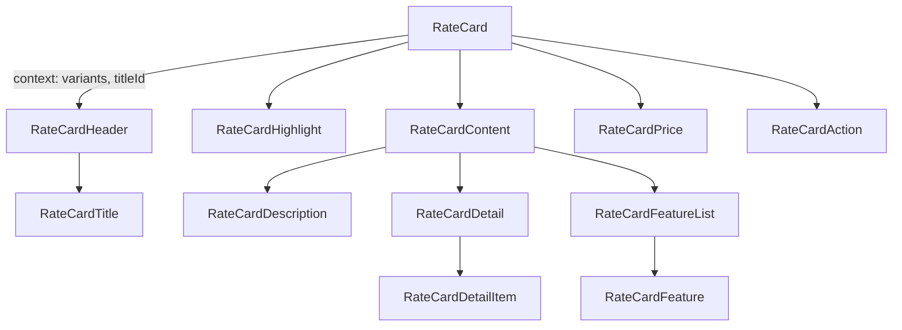

# Design: Rate card

## Overview

`RateCard` is a noninteractive `article` compound. The root owns the required variant and shares it through context so each part adapts density and layout. Consumers pass formatted price, translated copy, Badge/Button children and own grid, data and selection.

## Architecture



## Components

| Component                     | Responsibility                                                                    | Location                                   |
| ----------------------------- | --------------------------------------------------------------------------------- | ------------------------------------------ |
| RateCard                      | `article`, variant, highlight, accessible name                                    | `app/component/brand/stylex/rate-card.tsx` |
| RateCardHeader / Title        | Title row with trailing status slot; title defaults to `h3`, `render` swaps level | same                                       |
| RateCardHighlight             | Ribbon label such as "Most popular"                                               | same                                       |
| RateCardContent               | Groups text blocks; grows in `row`                                                | same                                       |
| RateCardDescription           | Muted supporting copy                                                             | same                                       |
| RateCardPrice                 | `prefix`, `amount`, `period`                                                      | same                                       |
| RateCardDetail / DetailItem   | `dl` of label/value meta (duration, validity)                                     | same                                       |
| RateCardFeatureList / Feature | `ul` of included feature with optional decorative icon                            | same                                       |
| RateCardAction                | Button slot, pinned to the bottom of column variants                              | same                                       |

## Example Code

```tsx
<RateCard variants="plan" highlight>
  <RateCardHighlight>Most popular</RateCardHighlight>
  <RateCardHeader>
    <RateCardTitle>Pro</RateCardTitle>
  </RateCardHeader>
  <RateCardPrice amount="฿2,400" period="/ hour" />
  <RateCardFeatureList>
    <RateCardFeature icon={<Check />}>Unlimited revisions</RateCardFeature>
  </RateCardFeatureList>
  <RateCardAction>
    <Button>Choose Pro</Button>
  </RateCardAction>
</RateCard>
```

## Risks & Mitigations

| Risk                         | Mitigation                                               |
| ---------------------------- | -------------------------------------------------------- |
| Row overflows on mobile      | Row wraps; responsive browser test covers 390px viewport |
| Hardcoded colors break Theme | Use `themeToken`; catalog includes dark Theme            |
| Heading hierarchy mismatch   | Title accepts `render` for heading level                 |
