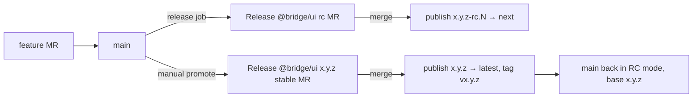

# Design: Release Promote Fix

## Overview

`promote` becomes "prepare stable": it versions on a branch and opens an MR; the existing `release` job publishes after merge. One publish path for RC and stable.

## Flow



## Components

| Component      | Responsibility                                                                                               | Location                 |
| -------------- | ------------------------------------------------------------------------------------------------------------ | ------------------------ |
| promoteRelease | pre exit → version → pre enter rc, guard published stable, push `changeset-release/stable`, create/update MR | `cmd/promote-release.ts` |
| publishPackage | unchanged; publishes `latest` when version has no `-rc.`                                                     | `cmd/publish-package.ts` |

## Example Code

```ts
run(["bun", "changeset", "pre", "exit"])
run(["bun", "changeset", "version"])
run(["bun", "changeset", "pre", "enter", "rc"])
if (published[stable]) throw new Error(`Stable ${stable} is already published; repair .changeset/pre.json base version`)
```

## Risks & Mitigations

| Risk                          | Mitigation                                                                                     |
| ----------------------------- | ---------------------------------------------------------------------------------------------- |
| RC MR and stable MR both open | Merging stable consumes changesets; the next `release` run refreshes the RC MR from new `main` |
| Stable MR goes stale          | Every promote force-updates `changeset-release/stable` from current `main`                     |
