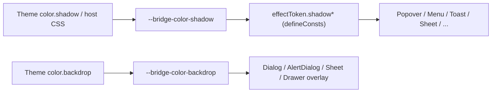

# Design: Effect Color Token

## Overview

Add two semantic effect colors to `token.stylex.ts` / `themeToken`, declare defaults in `component.css`, and derive every tint with `color-mix` so the single shadow color controls all elevation alpha steps. Defaults reproduce the prior literal output exactly.

## Architecture



## Components

| Component     | Responsibility                       | Location                                     |
| ------------- | ------------------------------------ | -------------------------------------------- |
| effectToken   | shared backdrop and shadow recipes   | `app/component/brand/stylex/token.stylex.ts` |
| Theme         | typed `backdrop` / `shadow` override | `app/component/brand/stylex/theme.tsx`       |
| component.css | public defaults + scrollbar vars     | `app/style/component.css`                    |

## Example Code

```ts
// app/component/brand/stylex/token.stylex.ts
const shadow = (alpha: string) => `color-mix(in oklab, var(--bridge-color-shadow, black) ${alpha}, transparent)`
export const effectToken = stylex.defineConsts({
  backdrop: "var(--bridge-color-backdrop, rgb(0 0 0 / 10%))",
  shadowMd: `0 4px 6px -1px ${shadow("10%")}, 0 2px 4px -2px ${shadow("10%")}`
})
```

BridgeCalendar colored all-day text: `color: contrast-color(var(--bridge-calendar-event-color))` is not yet Baseline, so use relative color: `oklch(from var(--bridge-calendar-event-color) clamp(0, (0.62 - l) * 999, 1) 0 h)` → white on dark events, black on light events.

## Risks & Mitigations

| Risk                                          | Mitigation                                                        |
| --------------------------------------------- | ----------------------------------------------------------------- |
| StyleX drops shared folded var (known defect) | use `defineConsts`, covered by existing undefined-var output test |
| Relative color unsupported in old browser     | same feature already used by Bubble tinted; acceptable baseline   |
