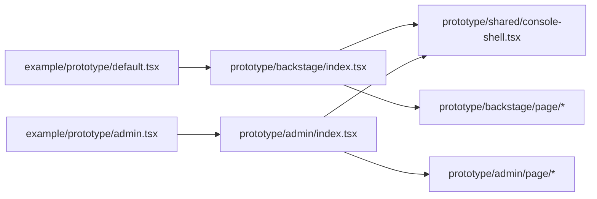

# Design: Console Prototype

## Overview

A shared `ConsoleShell` (Sidebar + ShellHeader + command palette + toasters) takes a declarative navigation config and
renders the active page from in-memory state (the catalog owns the URL hash). Each prototype supplies its own pages.
Catalog renders `prototype/*` full-bleed like `shell-header`.

## Architecture



## Components

| Component        | Responsibility                                                         | Location                                              |
| ---------------- | ---------------------------------------------------------------------- | ----------------------------------------------------- |
| ConsoleShell     | Sidebar nav, header title/action slot, ⌘K palette, user menu, toasters | `internal/catalog/prototype/shared/console-shell.tsx` |
| Backstage pages  | Studio domain composition                                              | `internal/catalog/prototype/backstage/page/*.tsx`     |
| Admin pages      | Generic SaaS composition                                               | `internal/catalog/prototype/admin/page/*.tsx`         |
| Guard            | Family coverage + default setting                                      | `test/internal/catalog-prototype.test.ts`             |
| Browser contract | Page traversal, error, overflow                                        | `test/browser/prototype.test.ts`                      |

## Example Code

```tsx
// internal/catalog/prototype/backstage/index.tsx
const BackstagePage = { DASHBOARD: "dashboard", QUEUE: "queue" } as const
export function BackstageConsole() {
  return <ConsoleShell brand="Backstage" navigation={navigation} render={(page) => pageComponent[page]} />
}
```

## Risks & Mitigations

| Risk                           | Mitigation                                                                              |
| ------------------------------ | --------------------------------------------------------------------------------------- |
| Catalog hash routing conflicts | Page state kept in React state, never in hash                                           |
| Bundle size gate               | Prototype is a lazy example chunk; heavy libs already split (three, tanstack, recharts) |
| Tailwind on wrapper layout     | Only layout utilities on plain elements; guard forbids appearance override on `UI.*`    |
