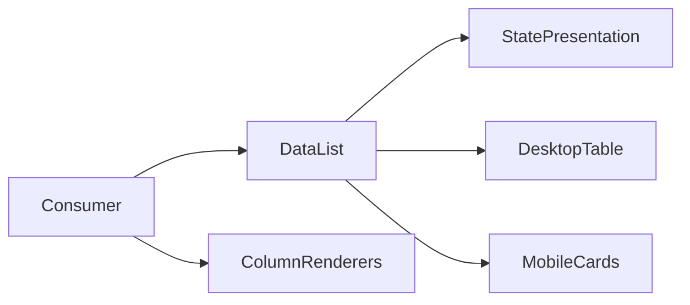

# Design: Generic Data List

## Overview

Implement a generic DataList frame with controlled status, optional heading, and metadata-driven columns/rows. Reuse existing DataState, Empty, Skeleton, Card, and Table primitives where suitable; keep all business behavior with the consumer.

## Architecture



## Components

| Component       | Responsibility                                       | Location                                   |
| --------------- | ---------------------------------------------------- | ------------------------------------------ |
| DataList        | Heading, status switch and responsive content layout | `app/component/brand/stylex/data-list.tsx` |
| DataListColumn  | Label and cell renderer contract                     | same                                       |
| TableCellStack  | Primary/secondary text composition                   | same                                       |
| TableCellValue  | Empty-value fallback                                 | same                                       |
| TableCellAction | End-aligned arbitrary action content                 | same                                       |

## Data Flow

1. Consumer supplies status, copy, retry callback, columns and rows.
2. DataList renders the requested state or ready content.
3. Ready rows render as a semantic table or labelled cards at narrow widths.

## Example Code

```tsx
<DataList
  variants={DataListVariant.auto}
  status={DataListStatus.ready}
  columns={columns}
  rows={rows}
  title="Proposals"
  description="Review proposal details"
/>
```

## Risks & Mitigations

| Risk                                      | Mitigation                                                              |
| ----------------------------------------- | ----------------------------------------------------------------------- |
| Responsive row semantics become ambiguous | Render explicit labelled definition-list cards at the narrow breakpoint |
| Consumer needs specialized actions/status | Cell render callbacks accept ReactNode and stay domain-agnostic         |
