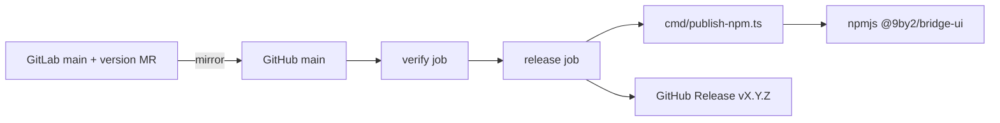

# Design: GitHub npm Release

## Overview

GitLab Changesets owns the version and CHANGELOG. GitHub receives the mirrored `main` and reacts to it. After verification, `cmd/publish-npm.ts` publishes the already-built `dist` under the public name `@9by2/bridge-ui` when that version is missing from npm. The workflow then creates the matching GitHub Release.

## Architecture



## Components

| Component     | Responsibility                                                    | Location                        |
| ------------- | ----------------------------------------------------------------- | ------------------------------- |
| workflow      | verify PR/main; release on main push only                         | `.github/workflows/release.yml` |
| publishNpm    | guard context, stage renamed manifest, publish, verify, emit note | `cmd/publish-npm.ts`            |
| release notes | CHANGELOG section for the version                                 | `releaseNote()` in same file    |

## Data Flow

1. A push to `main` runs `verify` (fmt, lint, typecheck, boundary, build, test, coverage, package, tree-shaking).
2. `release` builds, then runs `bun release:npm`.
3. The script exits early when there is no CHANGELOG entry. If npm already has the version, it skips publishing and still emits the outputs.
4. Otherwise it stages `dist` and `README.md` with the manifest renamed to `@9by2/bridge-ui`, sets public access, and adds `repository` (provenance needs it), then runs `npm publish --provenance --access public --tag latest`.
5. It polls the registry until the version resolves, installs it into a fixture, and imports `Button`.
6. It writes `version` and `release=true` to `GITHUB_OUTPUT` and writes the release notes file. The workflow creates `vX.Y.Z` with `gh release create` if the release doesn't exist yet.

## Example Code

```ts
const PublicPackage = {
  NAME: "@9by2/bridge-ui",
  REGISTRY: "https://registry.npmjs.org/",
  REPOSITORY: "git+https://github.com/9by2/bridge-ui.git"
} as const
```
