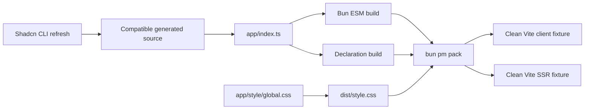

# Design: Phase 2 Package Foundation

## Overview

Normalize generated source first, then expose one root ESM package entry and one CSS entry. Bun bundles JavaScript while externalizing package dependencies. TypeScript emits declarations separately. A packed tarball is the only input to clean consumer fixtures.

## Architecture



## Component

| Component        | Responsibility                                      | Location                            |
| ---------------- | --------------------------------------------------- | ----------------------------------- |
| Public entry     | Stable public exports                               | `app/index.ts`                      |
| Build script     | Clean output, Bun build, CSS copy, declaration emit | `internal/script/build-package.ts`  |
| Package verifier | Validate tarball contents and consumer behavior     | `internal/script/verify-package.ts` |
| Client fixture   | Browser-oriented package import/build               | `internal/fixture/client/`          |
| SSR fixture      | Server-render package import/build                  | `internal/fixture/ssr/`             |

## Public Contract

```json
{
  "exports": {
    ".": {
      "types": "./dist/index.d.ts",
      "import": "./dist/index.js"
    },
    "./style.css": "./dist/style.css"
  }
}
```

Consumers import only stable package exports:

```tsx
import { Button, Dialog, Input } from "@bridge/ui"
import "@bridge/ui/style.css"
```

## Generated Refresh

Use Shadcn CLI dry-run/diff capability to inspect refresh output, then overwrite existing components through the CLI. Do not patch generated files manually. Record before and after hashes and CLI version.

## Build

Bun build uses:

- entrypoint `app/index.ts`;
- ESM format;
- browser-neutral JavaScript target suitable for Vite client and SSR;
- linked source map;
- runtime dependencies external;
- deterministic `dist/index.js` output.

TypeScript uses a separate emit config with declaration-only output. CSS is copied as `dist/style.css` until StyleX replaces the implementation in Phase 4.

## Package Test Seam

Tests observe package behavior only through a packed tarball:

1. Build package.
2. Pack tarball.
3. Install tarball in an isolated fixture directory.
4. Import root JavaScript and CSS export.
5. Typecheck fixture.
6. Build Vite client and SSR fixture.
7. Inspect output to ensure React is external/not duplicated.

## Risk & Mitigation

| Risk                                           | Mitigation                                                                 |
| ---------------------------------------------- | -------------------------------------------------------------------------- |
| CLI refresh changes visuals                    | Record diff; accept generated snapshot only as one atomic refresh.         |
| Root entry becomes manually incomplete         | Generate or verify export inventory against Shadcn filenames.              |
| Declaration emit leaks private paths           | Typecheck clean fixture from tarball.                                      |
| Bundle includes React                          | Externalize dependencies and inspect bundle metadata/output.               |
| Fixture accidentally resolves workspace source | Run in isolated temp directories with tarball install.                     |
| CSS is not final StyleX output                 | Keep CSS export stable; Phase 4 changes implementation, not consumer path. |
