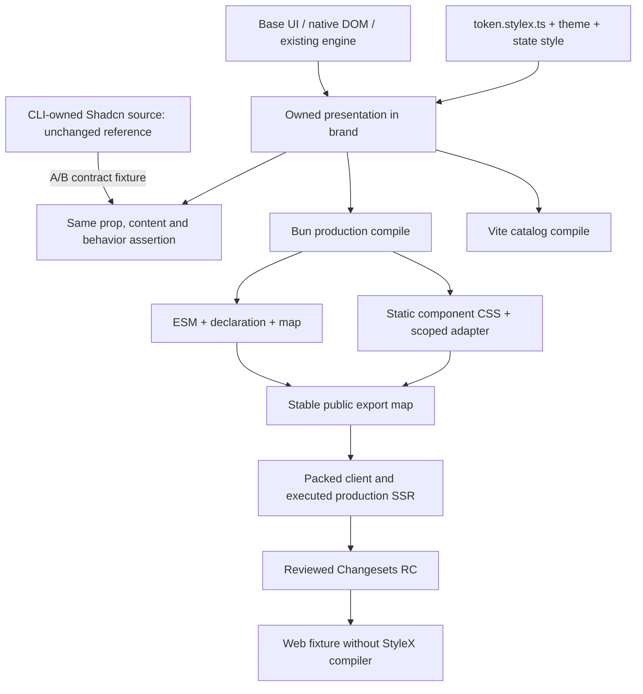

# Architecture And Implementation Design

## Source Ownership

Recommended, pending approval: author owned replacement presentation in `app/component/brand/<name>.tsx` over the same Base UI, native DOM or third-party behavioral primitive. Do not wrap generated Tailwind components and call them StyleX-complete. Do not hand-edit generated source. Preserve license/attribution when adapting existing logic. Avoid a second behavior engine or generic component factory.

For behavior with a module-private context (MultiSelect, Drawer, Carousel, Sidebar, Chart, ToggleGroup), migrate the entire family atomically. A new consumer cannot reach a private context in an old module by importing a similarly named component.



## File-Level Handoff

| Target                                                                         | Implementation responsibility                                                    | First proof                                                               |
| ------------------------------------------------------------------------------ | -------------------------------------------------------------------------------- | ------------------------------------------------------------------------- |
| `app/style/token.stylex.ts` (new)                                              | Named defineVars export only; semantic color, font, radius, space and motion     | Light/dark token resolution under both compiler paths                     |
| `app/style/theme.ts` (new)                                                     | Internal createTheme and compiled theme-prop selection                           | Nested theme and portal inheritance                                       |
| `app/component/brand/theme.tsx` (proposed new)                                 | Explicit Theme boundary and portal target only if scoped coexistence is approved | No global body mutation, SSR-stable theme, nested portal                  |
| `app/component/brand/button.tsx`, `input.tsx`, `field.tsx`, `dialog.tsx` (new) | Owned pilot; Label/Separator support owned alongside it                          | Same fixture against generated and candidate family                       |
| `app/style/adapter.css` (conditional new)                                      | Scoped third-party descendant rule only where engine API cannot reach the slot   | Selector allowlist, no host effect, documented deletion/upgrade condition |
| `internal/catalog/example/<name>/`                                             | Candidate A/B demonstration with identical content                               | Screenshot and interaction parity per state                               |
| `test/component/<name>.test.tsx`                                               | Owned runtime state/callback/ref coverage                                        | Red before production change; 100% all metrics                            |
| `test/internal/stylex.test.ts`                                                 | Token/state/keyframe extraction, no injected compiler output                     | Packed CSS and executable JS scan                                         |
| `test/internal/production-jsx.test.ts`                                         | Keep independent production React execution                                      | No jsxDEV import anywhere emitted                                         |
| `cmd/build-package.ts`, `vite.config.ts`, `vitest.config.ts`                   | Align compiler option, CSS layer order and entry resolution                      | Compare Bun package vs catalog computed style                             |
| `app/index.ts`, `package.json`, `cmd/verify-package.ts`                        | Root and subpath select one implementation for each promoted family              | Cross-entry identity and one context instance                             |
| `test/browser/visual.spec.ts`, new context/comparison spec                     | Expand beyond current DropArea-only visual coverage                              | Light/dark, 390/1280, reduced motion, RTL, open portal                    |

Names here are proposed, not existing API. Do not export raw StyleX style objects as a new consumer requirement. No directory named `src/` or product container.

## Experiment And Export Continuity

Start A/B within private catalog fixtures with explicit source imports; leave shipped export mapping unchanged. After the pilot is accepted, map root and relevant stable public paths to the SAME owned runtime module. Public wildcard names containing `shadcn` are already shipped, so physical source ownership can change without breaking those imports. Implement explicit entries for promoted paths, preserving the wildcard for the rest. Do not maintain two independent React contexts behind root and subpath.

Do not casually add a public `stylex` variant prop or permanent dual theme implementation. If external A/B requires an experimental path, approve its name and removal policy separately; preferred release comparison uses pinned RC versions with unchanged imports.

`buttonVariants`, `badgeVariants`, `toggleVariants`, `tabsListVariants`, navigation and similar string-returning helpers are real public API, not just internal implementation. A private StyleX object is NOT a compatible replacement for their class-string return. Preserve a static compiled class-string adapter for supported literal variant/size combinations, test inherited className/null/default behavior, or obtain explicit breaking-change approval. Audit each exported helper before promoting its family.

Root `MultiSelectValue` currently selects the owned badge treatment while the generated subpath exports the primitive value. Root `SonnerToaster` aliases Sonner's `Toaster` to avoid the Base UI toast `Toaster` name. Preserve these deliberate distinctions in the export manifest; do not flatten them by accident.

## Token And CSS Contract

Current `global.css` is a hybrid baseline, not the desired final isolated component CSS. Proposed final separation:

| Layer                       | Target responsibility                                                   | Migration rule                                                                    |
| --------------------------- | ----------------------------------------------------------------------- | --------------------------------------------------------------------------------- |
| Static component CSS        | StyleX atomic rule and component-local normalization                    | Loaded once by the existing CSS entry; no universal host reset                    |
| Theme boundary              | Canonical Cue semantic value; namespaced variable and explicit font     | Nested light/dark can coexist without inheriting legacy Web token accidentally    |
| Global application baseline | Optional document reset, body background, scrollbar and font-face setup | Separate opt-in global/font entry, not a surprise side effect of isolated use     |
| Third-party adapter         | Scoped engine selector only where slot API is insufficient              | Inventory each rule; no broad `!important` patch or silent full Tailwind fallback |
| Temporary legacy CSS        | Current generated component utility and token rule                      | Retain unchanged for unpromoted module, with a final removal gate                 |

The existing `@bridge/ui/style.css` global contract is already published. Do not silently remove its behavior during the pilot. Benchmark candidate CSS in isolated scope while legacy remains a baseline; decide the RC CSS/export change explicitly before consumer import behavior changes. A new opt-in component-only CSS entry is an approval point, not an undocumented release artifact.

Use named `defineVars` in `.stylex.ts`, `createTheme` for overrides, logical property for direction, and token-level motion. Namespaced token mapping must cover every current semantic variable including chart/sidebar, destructive text vs fill, font-number and reduced motion. Do not copy a low-contrast current pair blindly: keep visual conversion separate from a documented contrast correction.

Illustrative internal code, not a full Button implementation or approved public API:

```tsx
// app/style/token.stylex.ts
import * as stylex from "@stylexjs/stylex"

export const color = stylex.defineVars({
  surface: "oklch(1 0 0)",
  text: "oklch(0.145 0 0)",
  focus: "oklch(0.708 0 0)"
})
```

```tsx
// Within an owned module. Full state/ref/render merging still needs its test.
const style = stylex.create({
  root: {
    minWidth: 0,
    color: color.text,
    backgroundColor: color.surface,
    outlineColor: { default: "transparent", ":focus-visible": color.focus }
  }
})
```

Do not claim literal equivalence between arbitrary Tailwind selector strings and StyleX object keys. Prefer primitive state callback -> selected StyleX style; own slot -> local style; named parent marker -> `stylex.when`; external DOM -> engine API, then scoped adapter if necessary. Verify each API against the installed StyleX 0.19 compiler, not only current website documentation.

## Composition And Override

Preserve `className`, native `style`, `render`, ref, event, ARIA/data prop and slot identity where currently accepted. StyleX composition order resolves only StyleX input, not arbitrary external class precedence. Define explicit rules:

1. Internal base -> semantic variant -> size -> state -> approved component override composition.
2. Caller className remains attached, but conflict behavior with unrelated utility CSS is not guaranteed by concatenation. Test shipped concrete use such as Dialog width, Button margin/icon and Calendar day-button treatment.
3. Native inline style may override presentation, but must not accidentally erase engine positioning variable or transform. Merge required engine style explicitly and document reserved geometry.
4. `render` composition merges primitive event/ref, never clones away disabled or focus behavior. Prevent double callback firing.
5. Runtime dimension, ratio, progress and drag offset remain CSS variable/inline data. Static extraction does not mean banning legitimate runtime values or rewriting a renderer.

Own icon slot styling where possible. Button currently styles arbitrary SVG descendants and slot-dependent padding; preserve that behavior with an explicit slot strategy or a narrowly scoped compatibility rule. Removing it without a measured parity decision is a regression.

## Build Detail

The existing build externalizes dependency and peer modules, scans both component directories, emits split ESM/declaration/map and appends StyleX CSS to Tailwind CSS. It verifies only one extracted `min-height: 10rem` sentinel today. Replace that weak proof with assertions for each pilot state, theme override, media rule and keyframe. Assert zero runtime injection and zero `stylex.create` in emitted JS; allowing compiled `stylex.props` runtime is correct.

Align or explicitly prove Bun/Vite layer behavior. Preserve production JSX, React peer externalization, CSS side-effect metadata, packaged font resolution and declarations with no private alias. Build candidate fixture without Tailwind and without StyleX plugin on the consumer side. Run build-producing commands sequentially because they share `dist/`; do not compare a package generated concurrently by another test.

## Reference

- Source: `cmd/build-package.ts`, `vite.config.ts`, `app/style/global.css`, `app/index.ts`, `app/component/brand/drop-area.tsx`.
- StyleX documentation consulted via Context7: [defineVars](https://stylexjs.com/docs/api/javascript/defineVars/), [createTheme](https://stylexjs.com/docs/api/javascript/createTheme/), [when](https://stylexjs.com/docs/api/javascript/when/), [descendant styling](https://stylexjs.com/docs/learn/recipes/descendant-styles/).
- The website documents current API. Installed 0.19 behavior must be verified by a compile fixture before implementation relies on it.
